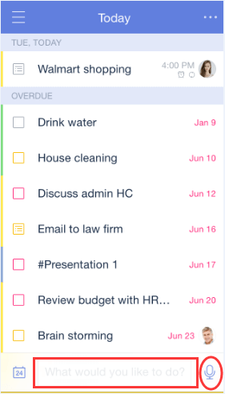
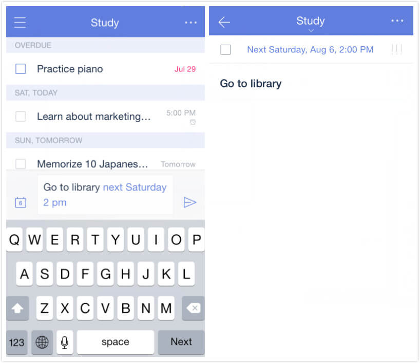
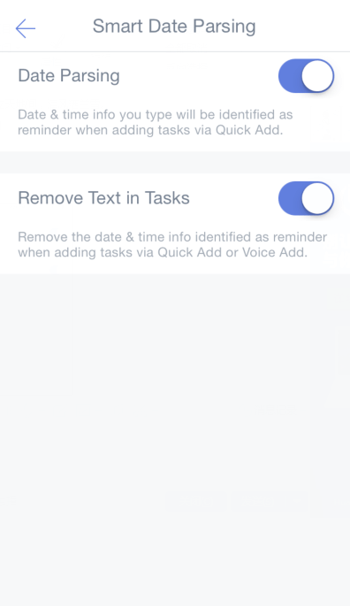
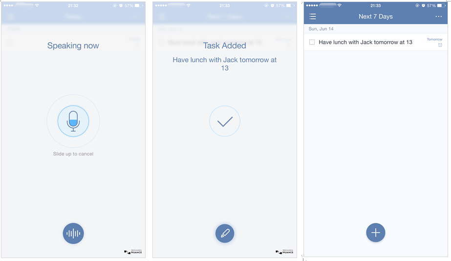

### How to create a new task?

TickTick gives you five different ways to create new tasks: The Add Button, Quick Add, Pull-Down Screen, Voice Input, and Siri Integration.

##### Option 1: Add Button \(default method\)

1. Open TickTick on your iOS device and slide the screen to the right.

2. Tap on a list you want to share, then tap on the "+" symbol at the bottom of the list to add a new item.

##### Option 2: Quick Add

1. Open TickTick on your iOS device and slide the screen to the right.

2. Tap the gear-shaped icon in the upper right corner, then tap "Advanced Settings".

3. Tap the "Quick Add" toggle button. Quick Add lets you enter new tasks in a dedicated data entry bar appearing at the bottom of a list page. Quick Add also provides a microphone button to press if you prefer to enter your new task orally.

##### Use Smart Date Parsing when adding tasks from Quick Add bar

If you enter date and time information in the text of your new task, TickTick will automatically recognize the date as the due date and set the time as the the reminder time for that task.

For example, if you want to go to library next Saturday at 2 p.m., you need only type: "Go to library next Saturday 2 pm". TickTick will automatically recognize the date of next Saturday as the task’s due date and set 2 pm as the reminder time for that task.

##### Remove date & time info from task content when using Smart Date Parsing

If you prefer that the date and time not appear in the text of your task content after you've created the task, you can set TickTick to remove it without affecting the scheduling of your task. Go to Settings, then tap "Advanced Settings", then tap "Smart Date Parsing", then tap "Remove Text in Tasks".

After "Remove Text in Tasks" is enabled, the highlighted date & time text will no longer appear in the text of your task content after you create the task.

##### Option 3: Pull-down Screen

1. Pull down the screen.

2. In the "Today" section, tap "Add New".

Note that if TickTick is not in the "Today" section, you should add it by tapping "Edit" at the bottom of pull-down screen.

##### Option 4: Voice Input using the Add Button \("+"\)

1. Open TickTick on your iOS device.

2. Press & hold the Add Button \("+"\) at the bottom of the task page to start speaking.

You can say, for example, "Have lunch with Jack tomorrow at 1 pm". After saying that, a new task to have lunch with Jack will be added with due date of tomorrow and a reminder time of 1 p.m.

If TickTick can’t recognize your language, check "Voice Input".

##### Option 5: Siri Integration

1. Open TickTick on your iOS device and slide the screen to the right.

2. Tap the gear-shaped icon in the upper-right corner.

3. Tap "Advanced Settings", then tap "Reminders & Siri".

4. Enable "Siri Integration" by tapping the toggle button.

After you enable Siri Integration, tasks you’ve created in Apple’s Reminders app and tasks you’ve created with Siri will be removed from Apple’s Reminders app and shown in TickTick’s Inbox.

