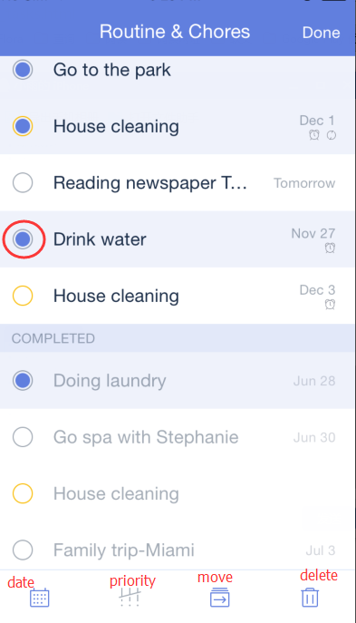

### How to batch edit tasks?

1.Open TickTick on your iOS device and tap the option menu in the upper-right hand of the screen.

2.Tap “Edit”

3.Select & edit multiple tasks. 

There are four icons at the bottom of the screen. They are used to change due date, set priority, move the task from this list to another and delete task. 

