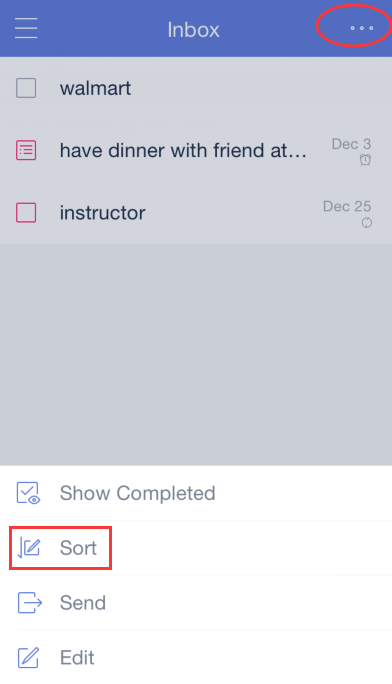

### How to change the order of the tasks?
Open TickTick on your iOS device and tap the option menu in the upper-right hand corner of the screen to select “Sort”.

Tasks under self-defined lists and “Inbox” can be sorted by due date, title, and priority.

Tasks in “All” "Today" and "next 7 days"can be sorted by list, due date, title, and priority.

Tasks in a shared list can be sorted by assignee.

**-How to drag tasks to change their order?**

1.Sort tasks by “Custom”.

2.Press and hold a task to drag them manually.

**-How to resume the original sort after you drag tasks?

When you dragged tasks under due date sort, the order will be resumed if sorted by due date again.

