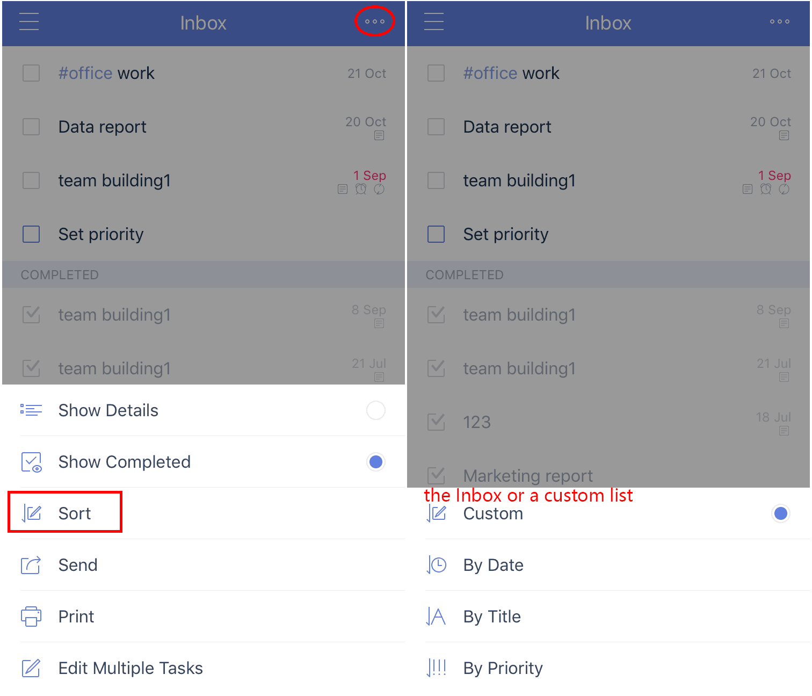
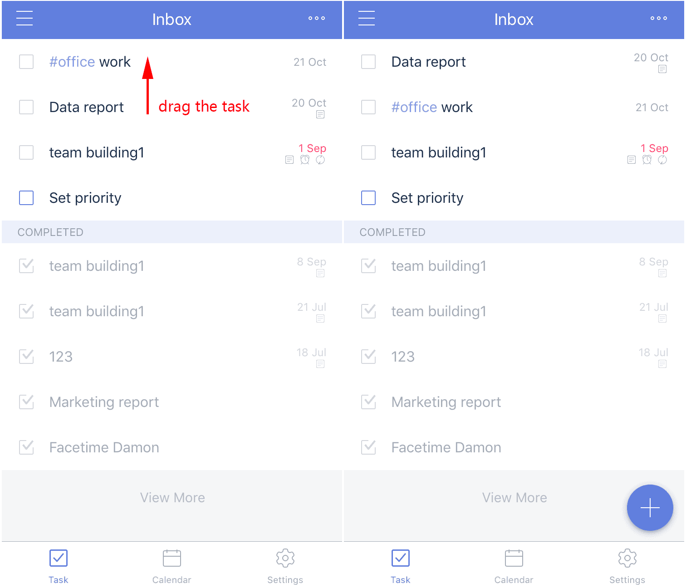

### How to change the order of the tasks?

##### Option 1 - Using the Sort feature

1. Open TickTick on your iOS device, then tap the option menu in the upper-right corner, then tap "Sort".

2. Sort tasks by due date, title, or priority if you're sorting the Inbox or a custom list.

3. Sort tasks by list, due date, title, or priority if you're sorting the "All", "Today", or "next 7 days" lists.

Note that tasks in a shared list can also be sorted by assignee.

##### Option 2 - Drag tasks to change their order

1. Repeat step 1 from Option 1 above and sort tasks by "Custom".

2. Press and hold a task to drag them manually.

##### How to resume the original sort after you drag tasks?

Use Option 1 above to sort the list the way you like it.

