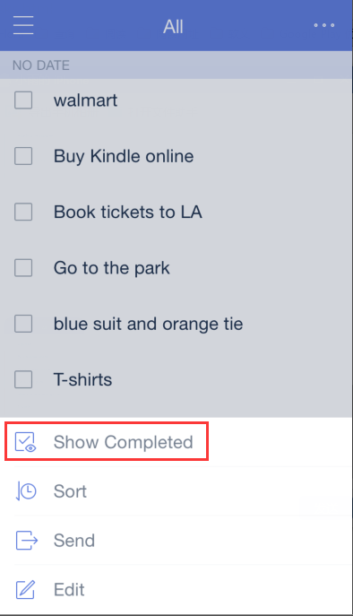

### How to hide/show completed tasks in each list?
When you check off a task, it will automatically move to the end of list as a completed task. To hide/show them, you can click the option menu in the upper-right hand corner to select “Hide/Show Completed”. 

