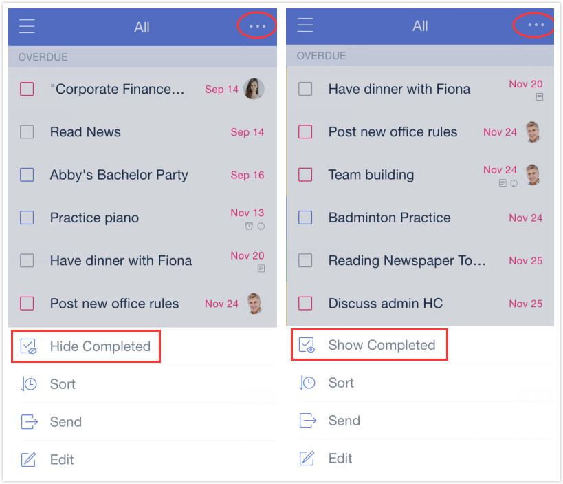

### How to hide/show completed tasks in each list?

When you check off a task, it will remain visible but will be automatically moved to the end of the list and marked as a completed task. To hide completed tasks, tap the option menu in the upper-right corner, then tap “Hide/Show Completed” to toggle between hiding and viewing your completed tasks.

