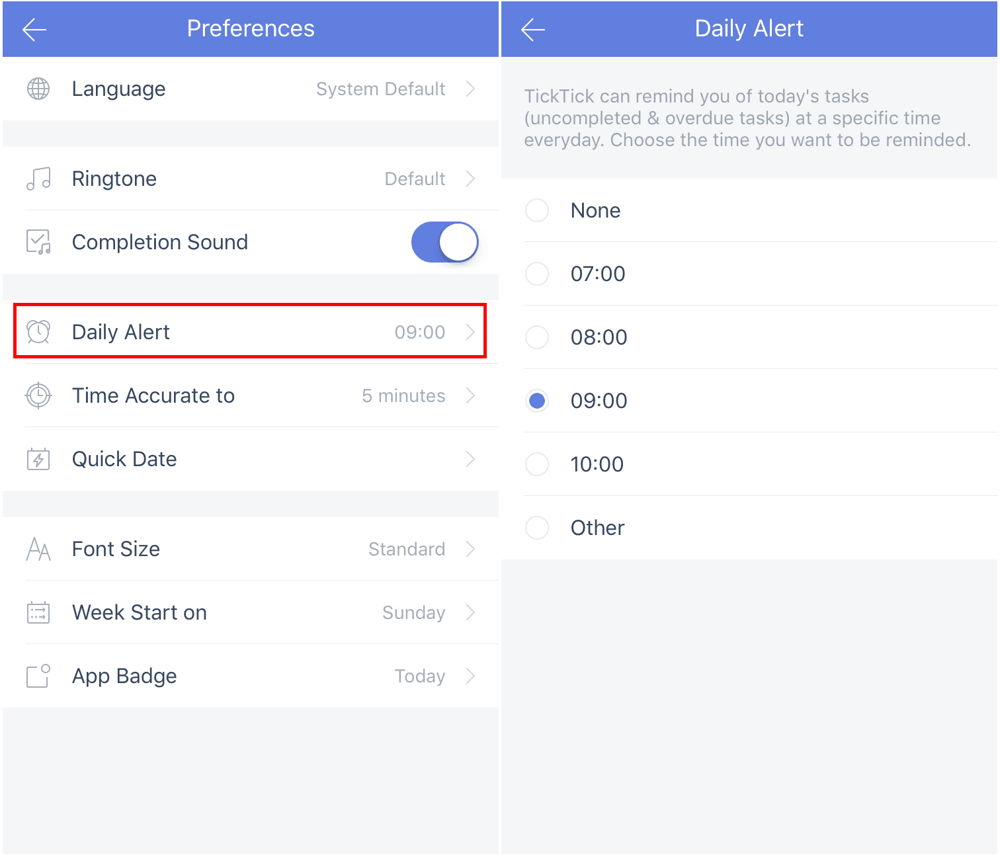

### How to set "Daily Alert"?

Daily Alert is a daily summary of all of your "Overdue" and "Today" tasks. You can set the Daily Alert to go off at a specific time every day.

1. Open TickTick on your iOS device and go to the Settings tab.

2. Tap the gear-shaped icon in the upper-right corner.

3. Tap "Preferences", then tap "Daily Alert", then set a daily alert time.

