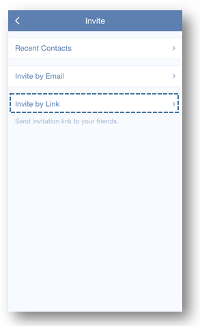

#### How to share task lists?
With a shared list, it is easy to check a shopping list with your parents or discuss a meeting agenda with your colleagues.

**-Option 1: Add recipients**

1.Open TickTick on your iOS device and select a list.

2.Tap the option menu in the upper right hand corner of the page to select “Share”.

3.Tap add icon in the upper right hand corner of the page.

4.Tap “Invite by Email” to enter email address.

You can watch the video below from 00:00 to 00:23.

<iframe width="640" height="390" src="https://www.youtube.com/embed/CTW6geOAGtw?list=PLbWRKVi0_aTEwRLCS5T4MD0wCQU_ve8xW" frameborder="0" allowfullscreen></iframe>

**-Option 2: Share via link**

1.Open TickTick on your iOS device and select a list.

2.Tap the option menu in the upper right hand corner to select “Share”.

3.Tap add icon in the upper right hand corner of the page.

4.Tap “Invite by Link” and select a platform to share the link with others.

If someone clicks the link, TickTick will send a notification asking you whether you would like to add him or her to the list. If you agree, the shared list will be copied to your friends’ TickTick account automatically. 

