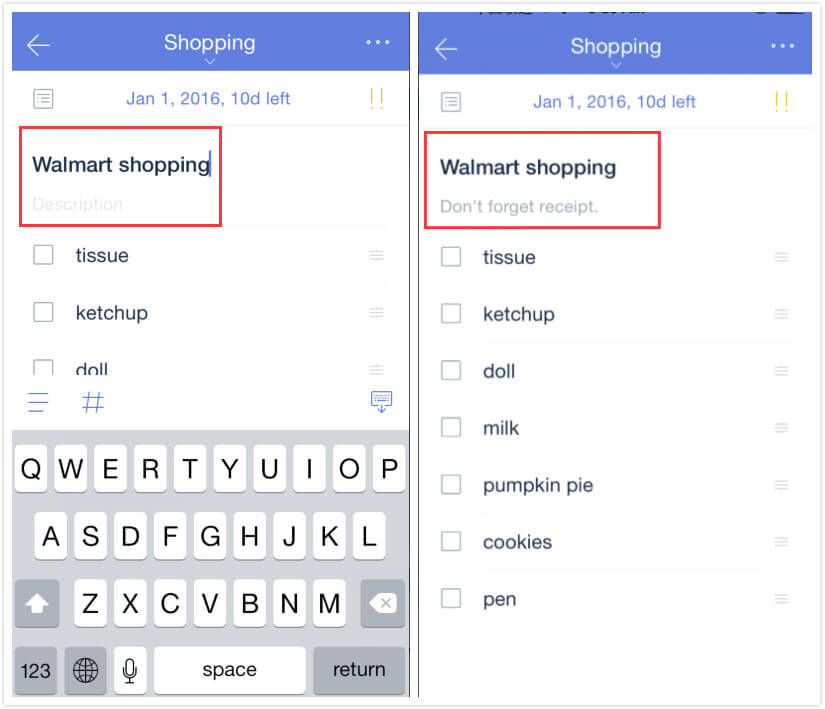

### How to create a checklist?

1.Open TickTick on your iOS device and select a task.

2.Click the icon of checklist above keyboard.

Checklist is mostly used to create shopping list, packing list, etc. You can't set due date or priority for these checklist items, but instead you can drag and drop to change the order of checklist items. 

###How to add description to a task with checklists?（Pro only) 

Enter a task with checklists and tap task title or one of the checklists to be in "edit" mode, then the "Description" field will appear. 

Then you can add necessary description for it.

