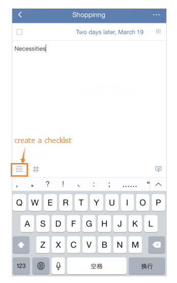

### How to create a checklist?

**Option 1:**

1.Long press the “+” icon under a list.

2.Click “Checklist” at the bottom and then enter checklist items one by one.

**Option 2:**

1.Enter a task detail page.

2.Click the “checklist” icon to create a checklist.

It is mostly used to create shopping list, packing list. Checklist items can’t be set due date individually but they can be dragged to change order.
