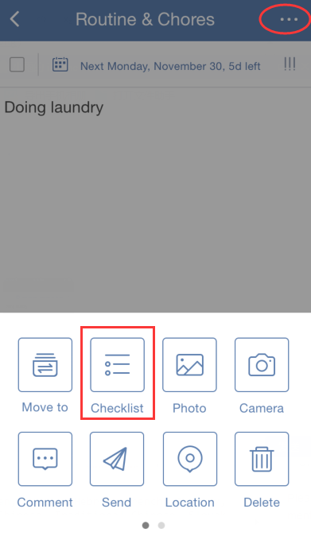
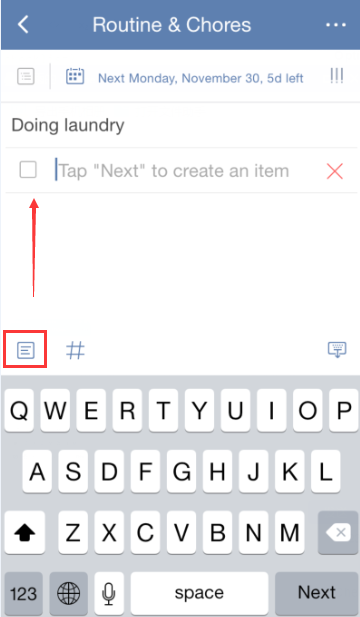

### How to create a checklist?

**Option 1:**

1.Open TickTick on your iOS device and select a task.

2.Tap the option menu in the upper right hand corner of the page to select “Checklist”.

 
**Option 2:**

1.Open TickTick on your iOS device and select a task.

2.Click the icon of checklist above keyboard.

Checklist is mostly used to create shopping list, packing list, etc. You can't set due date or priority for these checklist items, but instead you can drag and drop to change the order of checklist items. 
