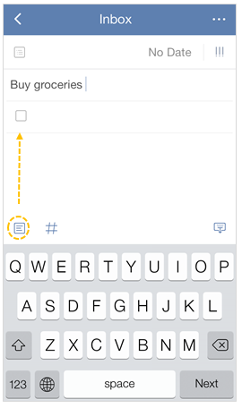

### How to create a checklist?

**Option 1:**

1.Select a task.

2.Tap the option menu in the upper-right hand of the screen.

3.Tap “Checklist” in the lower part of the screen.

**Option 2:**

1.Select a task.

2.Click the icon of checklist directly.

Checklist is mostly used to create shopping list, packing list, etc. You can't set due date or priority for these checklist items, but instead you can drag and drop to change the order of checklist items. 
