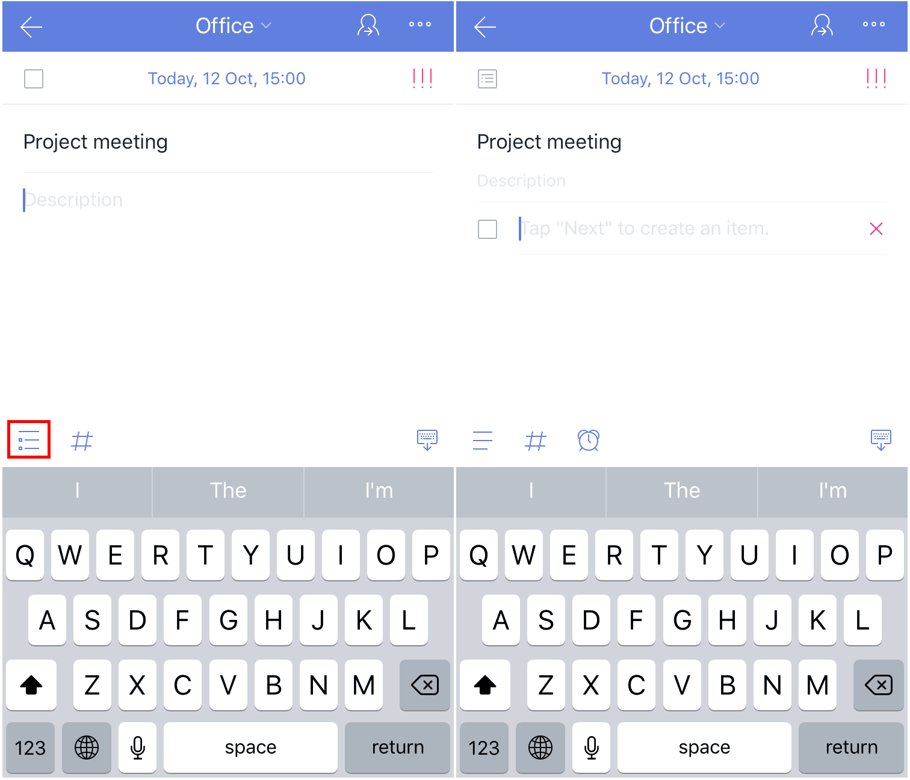
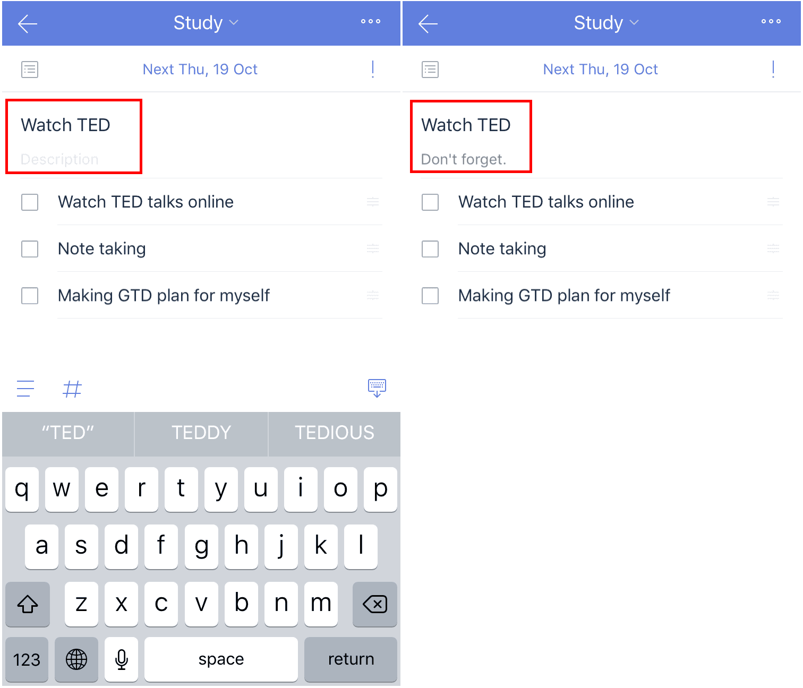

### How to create a checklist?

1. Open TickTick on your iOS device, select a task, then tap on the task description to bring up the on-screen keyboard.

2. Tap the checklist icon on the left side of the screen just above the keyboard to toggle between checklist and block text modes.

Checklist mode is useful for creating shopping lists, packing lists, etc. You can't set a due date or a priority for these checklist items. However, you can change the order of checklist items with the drag and drop method.

### How to add description to a task with checklists?（Premium only\)

Tap on a task containing a checklist, then tap the task title or one of the checklist items to switch to "edit" mode, then the "Description" field will appear.

You can then add more descriptive details for the task containing the checklist. This can be useful for reminding yourself of key information, sharing information about the checklist with other TickTick users with whom you've shared that task, and more.

