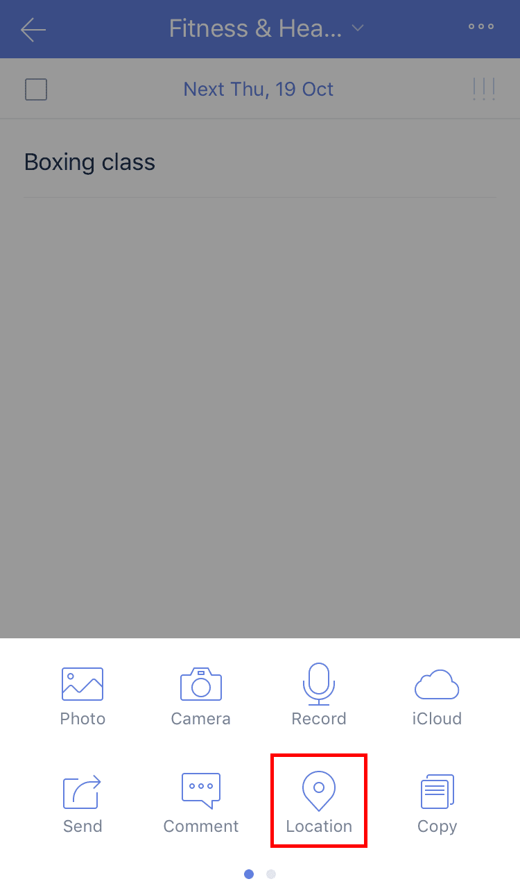

### How to set a location reminder?

For Location reminder to work, Location Services needs to be enabled on your phone.

1. Open TickTick on your iOS device and select a task that you want to set location reminder. for

2. Tap the option menu in the upper-right corner, then tap "Location".

3. A map will be automatically loaded into your task. You can choose to be reminded of the location either as you approach the destination or as you begin to leave your location en route to the destination.

