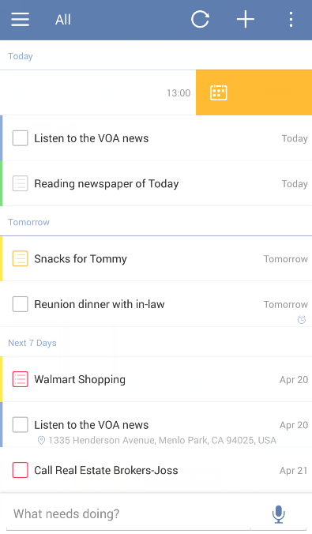

### How to swipe tasks for quick actions?
Swiping a task to the left until the organe bar become blue will generate four different icons. They are used to change due date, move task to another list, set priority, and delete. 

Swipe a task to the left and drop it before the orange bar reaches the middle of the task bar. Then a pop-up window will appear which is used to set due date and reminder. 

