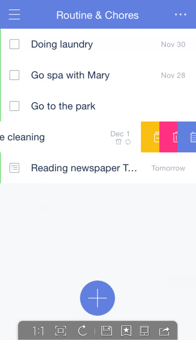
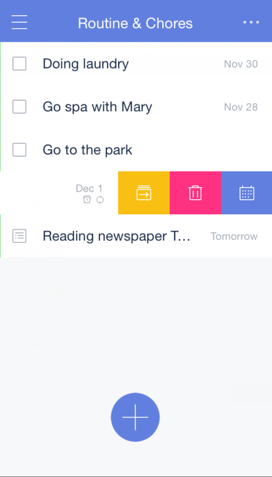
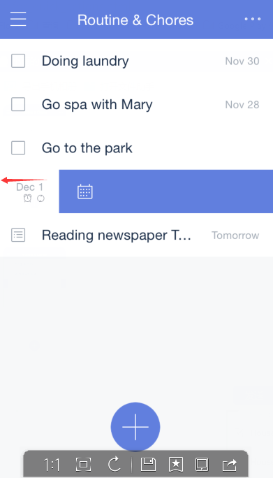
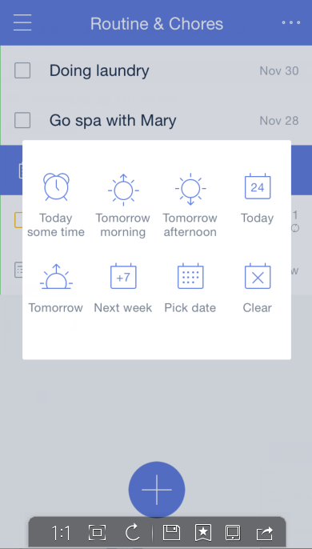

### How to swipe tasks for quick actions?
Swipe a task to the left, and then three icons with different background color will appear . They are respectively used to: move task from one list to another, delete the task, and change due date. 

Swipe a task to the left until the task bar becomes blue. Then you can set due date and reminder time in the pop-up window. 

