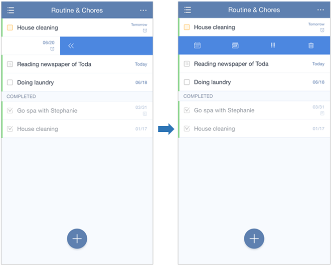
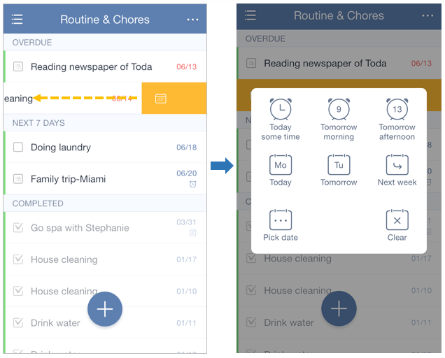

### How to swipe tasks for quick actions?
Swipe a task to the left until the task bar becomes blue, and then four different icons will appear. They are used to change due date, move task from one list to another, set priority, and delete task. 

Swipe a task to the left until the task bar becomes orange. Then a pop-up window will appear, where you can set due date and reminder. 

