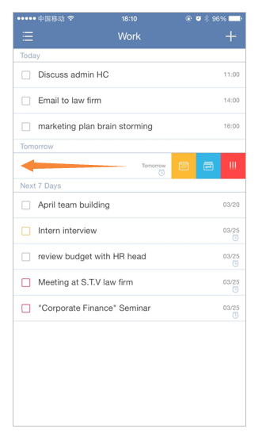

### How to swipe tasks for quick actions?
There are three different colors of menu for frequently used actions and you can slide a task from right to left to choose menu. Orange stands for set due date; blue stands for move to another list and red stands for set priority.

