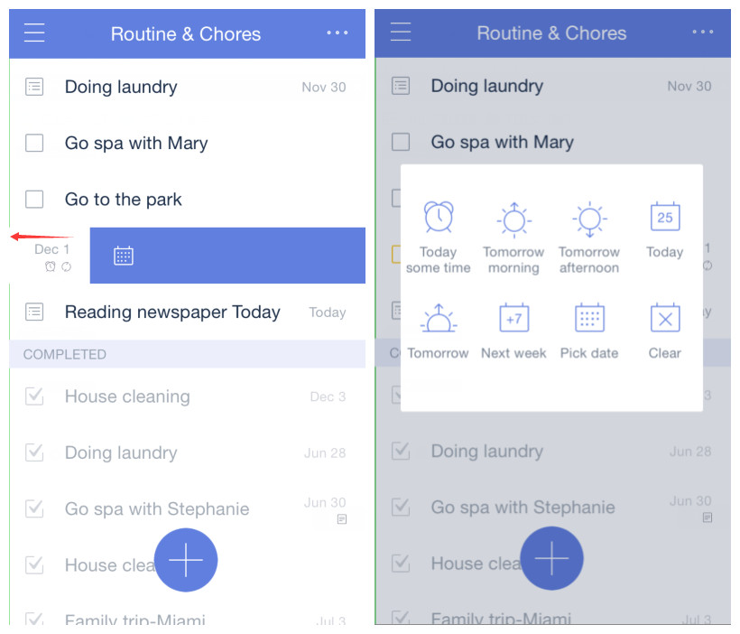

### How to swipe tasks for quick actions?

Swipe a task to the left, and then three action buttons with different background color will appear:

1. Move a task from one list to another.

2. Delete the task.and change due date.

3. Change the task's due date, time, reminder times, and recurring task options.

Note that if you swipe a task to the left until the taskbar becomes blue, then you can set the due date, time, reminder time, and recurring task options.  

