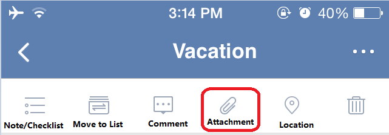

### How to upload attachment？
1.Select a task and click the option menu on top right corner.

2.Tap the “attachment” icon.

3.Select the attachment type (image, taking photo, recording).

After you successfully upload a attachment, you can long press the attachment to trigger deletion.

