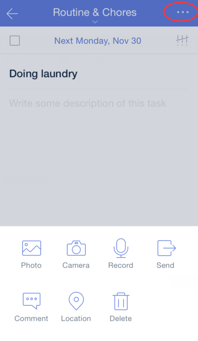

### How to upload attachments?

Uploading attachment is free for all users. You can add photos and even voice memos to a task.

Note that free accounts have a more restrictive limitation on the number of attachments permitted per day compared with the Premium version of TickTick.

1. Open TickTick on your iOS device and select a task.

2. Tap the option menu in the upper-right hand corner.

3. Select “Photo”, “Camera”, or “Record” to upload the relevant attachment to the task in TickTick.

