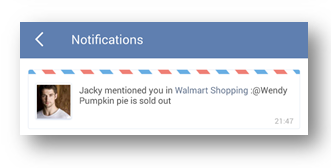

### How to add comment to a task?
1.Open TickTick on your iOS device and select a task that you want to add comment.

2.Tap the option menu in the upper right hand corner of the page to select “Comment”.

If it is a shared task, all recipients can view and leave comment to this task.

 

“Comment” is always used to add extra remarks to a task. Within a shared list, all shared members can comment on any tasks to realize real chat & communication. If you want to @reply someone in a shared list, you can enter “@” to select a member or click the icon to reply someone directly. 

The member you @reply will get notification in TickTick immediately. 

