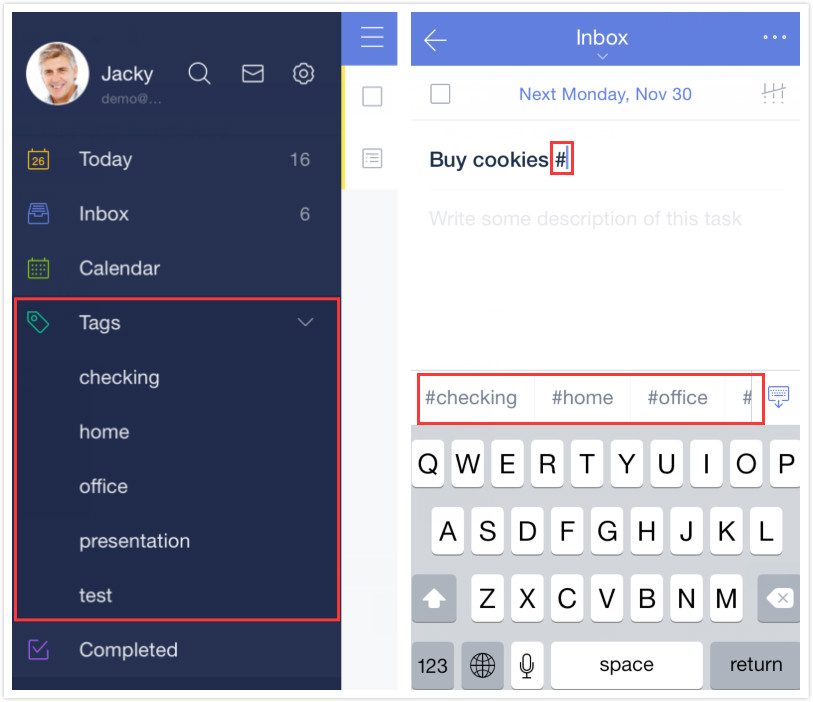

### How to add tags to a task?
To tag a to-do, simply add a hashtag to a keyword. For example, #holiday. Each task is allowed to be labeled by at most 5 tags.

You can check all of your tasks labeled by tags in “Tags” list.“Tags” list is hidden by default. To enable it, please turn to 3.2.1 for more details. 

