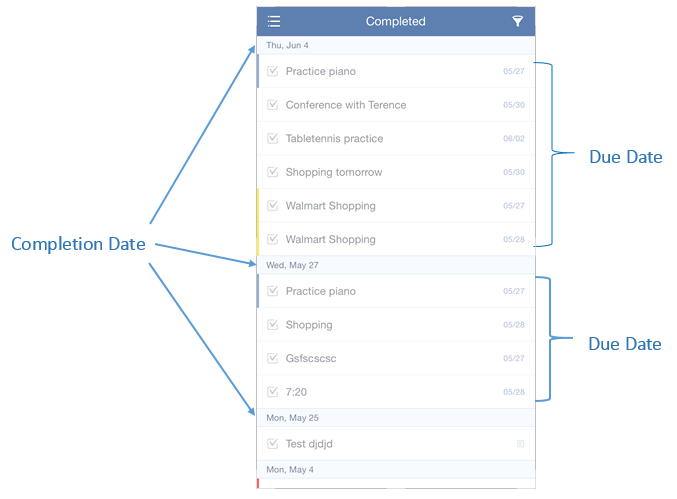

### Where can I check all of my completed tasks?
You can check all completed tasks in “Completed” list. “Completed” list is hidden by default. To enable it, please turn to 3.2.1 for more details.

Tasks in “Completed” are sorted by completion date. You can view all completed tasks from a specific list by clicking the icon of "funnel" in the upper-right hand corner of the page.

