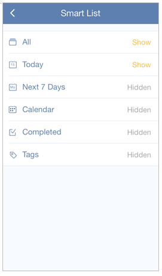

### How many “Smart lists” are there in TickTick?
There are 7 default lists in TickTick: All, Today, Next 7 Days, Inbox, Calendar, Completed, and Tags. Some of them are hidden by default, and you can enable them by the following steps:

 
#####Take “Completed” as an example:
1.Open TickTick on mobile and slide the screen to the right.

2.Click the gear-shaped icon in the upper right hand corner of the page.

3.Tap “Smart List”.

4.Tap “Completed” to enable it.

