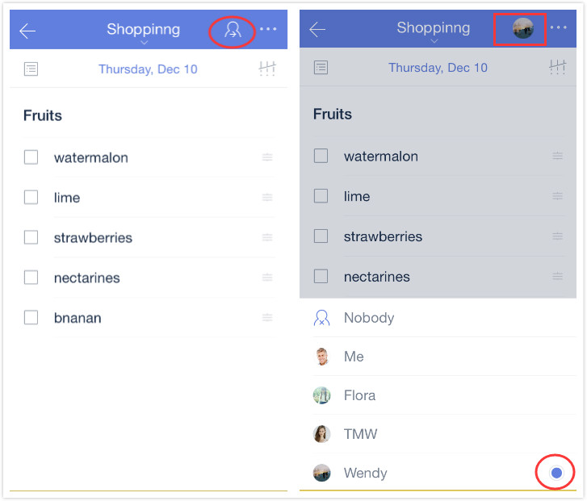

### How to assign a task?
Please note that the person you want to assign a task to has to accept your invite to a shared list before you make him responsible for that task.

Use the following steps to assign tasks:

1.Open TickTick on your iOS device to select a shared list, then choose a task in the shared list.

2.Tap the assign icon in the upper right hand corner of the page.

3.Tap the avatar of member you want to assign to, finish choosing recipients.

 

If you want to view all of your tasks that are assigned to you, you can enable the smart list “Assigned to me”. 