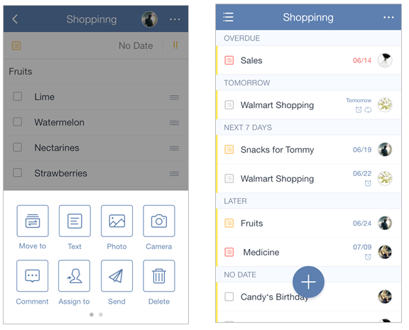

### How to assign a task?
In TickTick you can assign tasks in a shared list. Please note that the person you want to assign a task to has to accept your invite to a shared list before you make him responsible for that task.

Use the following steps to assign tasks:

1.Open TickTick on mobile to select a shared list and a task.

2.Tap the option menu in the upper right hand corner of the page.

3.Tap “Assign to” to choose a recipient.

You can watch the video below from 00:55 to the end.

<iframe width="700" height="400" src="https://www.youtube.com/embed/CTW6geOAGtw?list=PLbWRKVi0_aTEwRLCS5T4MD0wCQU_ve8xW" frameborder="0" allowfullscreen></iframe>
