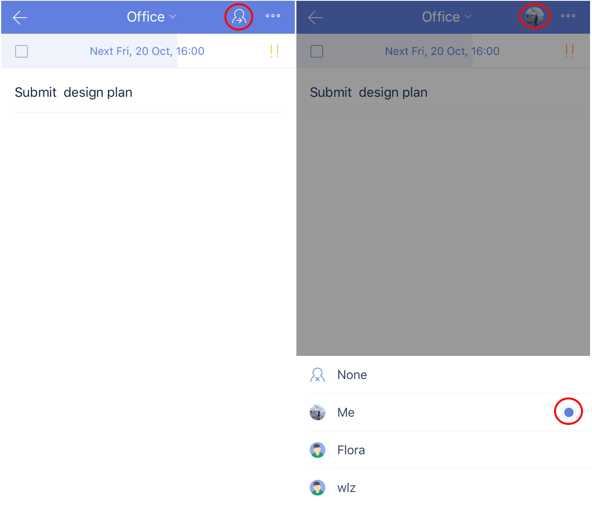

### How to assign a task?
Please note that the person you want to assign a task to has to accept your invitation to a shared list before TickTick will assign them responsibility for that task.

1. Select a shared list, then choose a task in the shared list.

2. Tap the assign button. This is the icon of a human bust with a small arrow pointing rightward. This icon is found in the upper-right corner.

3. Tap the avatar of member you want to assign the task to, then finish choosing recipients.

 

If you want to view all of your tasks that are assigned to you, you can enable the smart list "Assigned to me" 

