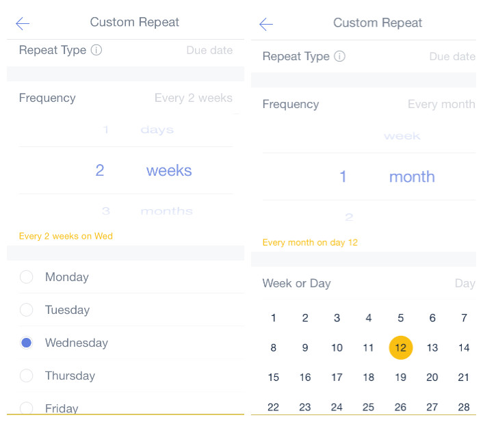
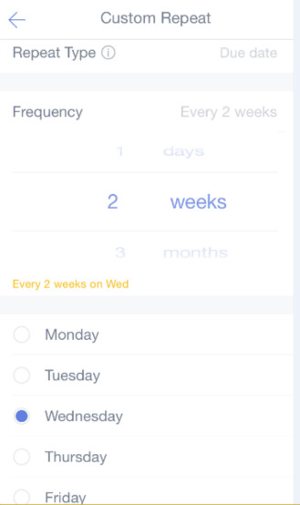

### How to create a recurring task?
TickTick lets you automate the entry of tasks that you perform more than once, for example, a daily workout. 
 
**What's the difference between Defulat repeating mode and Custom repeating mode?**

Default modes are "Daily", "every weekday", "Weekly", "Monthly", "Monthly" (same day of the week), and "Yearly".  Custom modes consist of "Repeat from Due Date" and "Repeat from Completion Date". To separate these repeating modes, here is an example:

Scenario: Let's say you have a recurring task like emptying your spam email. You've set a due date of June 15 to repeat every 2 days. But you don't check the task for the 15th off until June 18. Here's what happens under the different modes:

***1.Default repeating mode: the next repeating date is Jun 19.***

In Default mode if you check your June 15 task off on the same day (the due date), the next task should be generated on Jun 17, and then on June 19, June 21, etc. But if you check the June 15 task off after June 17, the next recurring date will be generated after completion date. Thus the next recurring date will directly move to June 19 rather than June 17.

***2.Custom repeating mode:: the next repeating date could be June 17 or June 20.***

*If you set Custom repeating to Due Date mode, the next repeating date is June 17.*

The only difference between the Default and the Custom: Due Date modes in the above scenario is that Due Date mode won't move to the date in the future. Thus even though Jun 17 is past, it will become the next recurring date.

*2)If you set Custom repeating to Completion Date mode, the next repeating date is June 20.*

This repeating mode is totally based on your completion date and chosen interval, regardless of your due date. So, under the scenario above, the Completion Date mode sets the next scheduled deadline 2 days ahead of the date the task was marked completed.

