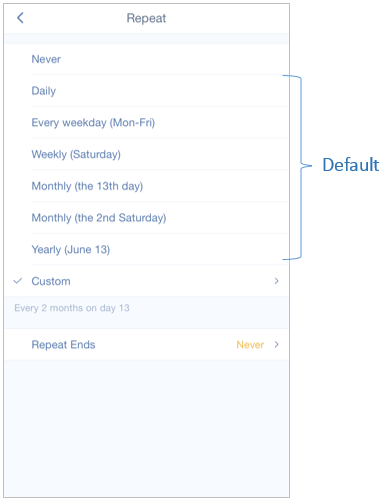
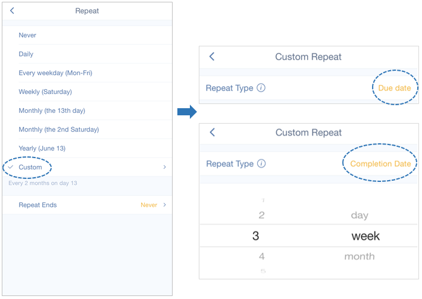
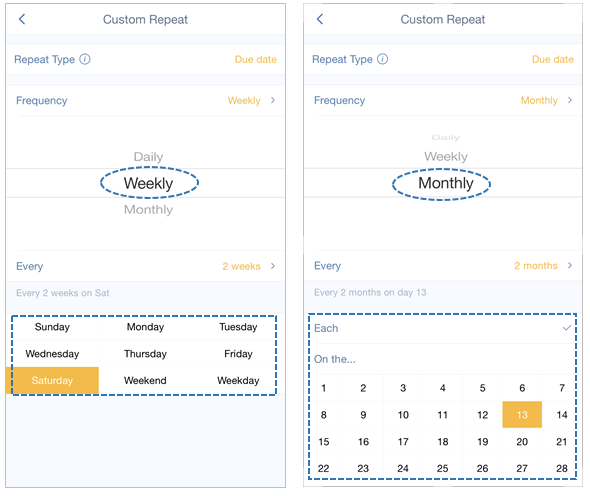
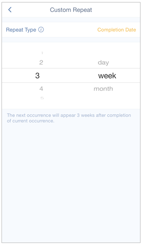

### How to create a recurring task?
You can set different kinds of recurring tasks in TickTick. Once you check off a recurring task, the task will roll to the next recurring date according to the repeating interval. 

 

**-What’s the difference between Defulat repeating and Custom repeating?**

There are totally two major repeating modes: Default and Custom. And Custom can be divided into “Repeat from Due Date” and “Repeat from Completion Date”. To separate these repeating modes, here is an example:

Let's say we have a recurring task which due date is Jun 15, repeating every 2 days, but you check it off on Jun 18.

***1.Default repeating mode: the next repeating date is Jun 19.***

Normally if you check it off on Jun 15 (due date), the next task should be generated on Jun 17, and then on June 19, June 21, etc. But if you check it off some days later, the next recurring date will be generated after completion date. Thus the next recurring date will directly move to Jun 19 rather than Jun 17.

***2.Custom repeating mode:***

*1)From Due Date: the next repeating date is Jun 17.*

The only difference between “Default” and “From Due Date” is that “Repeat From Due Date” won’t move to the date in the future. Instead the repeating date will be generated strictly based on your repeating mode. Thus even though Jun 17 is past, it will become the next recurring date. 

*2)From Completion Date: the next repeating date is Jun 20.*

This repeating mode is totally based on your completion date and repeating interval, regardless of your due date. 

