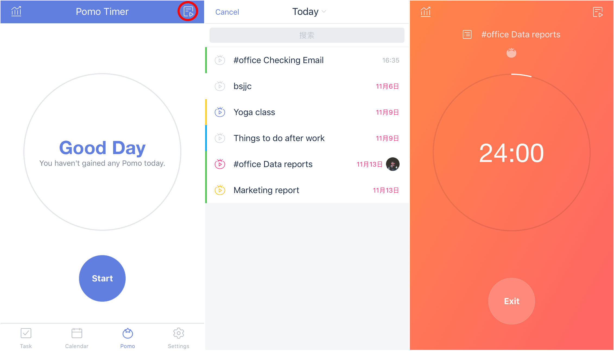
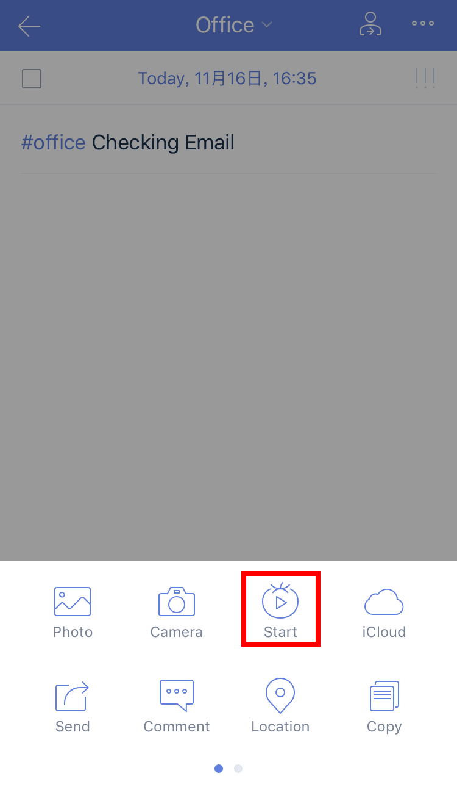
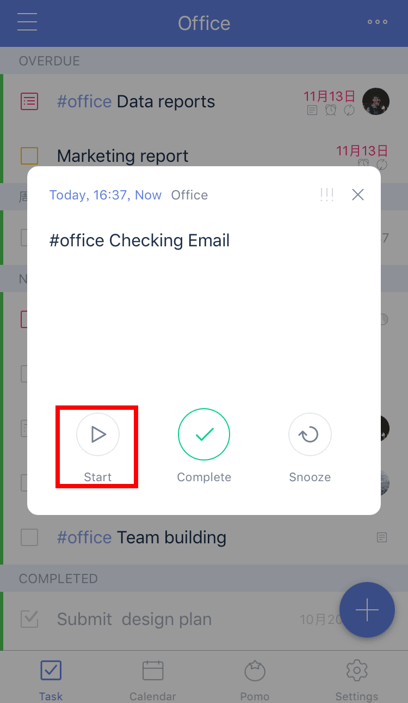
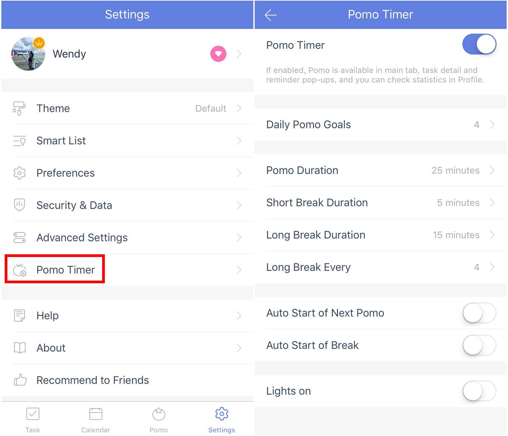

####Three ways to start a pomo
#####From the pomo tab page:
1. Open TickTick and go to the pomo tab page.
2. Tab "Select a task" area at the top and select a task you would like to work on with a pomo.
3. Tap "Start" once you are ready to begin focusing.

##### From a task view: 
Click the "..."icon at the top right->Tap "Start" the pomo icon.

#####From a task notification:
When a notificaiton pops up in TickTick, you can tap "Start" the pomo icon and begin to focus rightaway.

 
####How to custom my Pomo settings?
1. Tap the mini pomo icon at the top right of the pomo page, or go to "Pomo Timer" from the Settings page.
2. Customize the settings such as Short break Duration, Long Break Duration,etc.

**Tips** :"Lights on" is a function that will allow the screen to remain bright during a Pomo once you turn it on.

 

####Can I skip to break or pause a pomo?
No. Except for abandoning the current pomo, the function is not designed to be interrupted by other actions. The pomo timer  function was developed based on The Pomodoro Technique - one of the most useful time management methods in the world. For more info: https://cirillocompany.de/pages/pomodoro-technique

