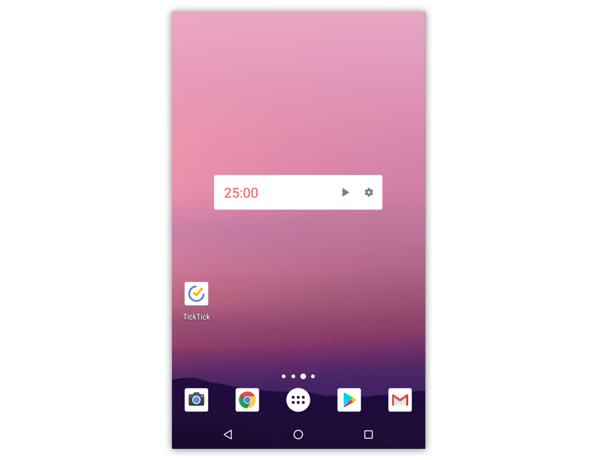

### Pomo timer for widget 
To add the widget for pomo timer, you need to go to the Widgets settings on your device. Find TickTick's widget lists and select to add the pomo timer widget.

It allows you to start a pomo from the home screen without entering the app. 

**P.S.** This is a premium function.