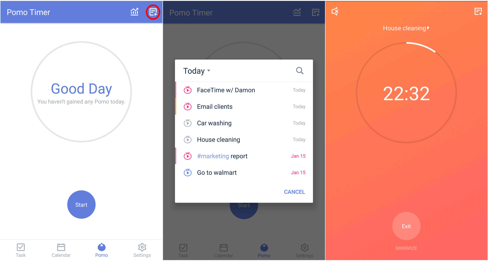
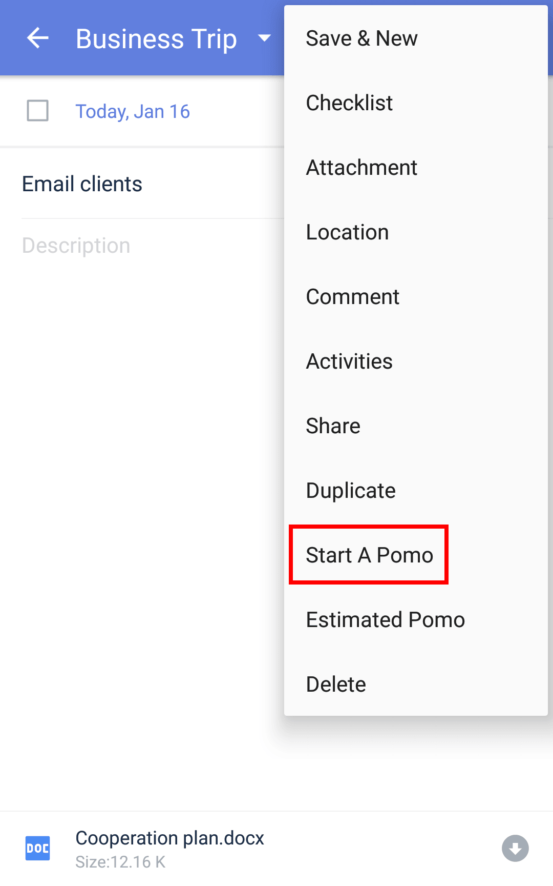
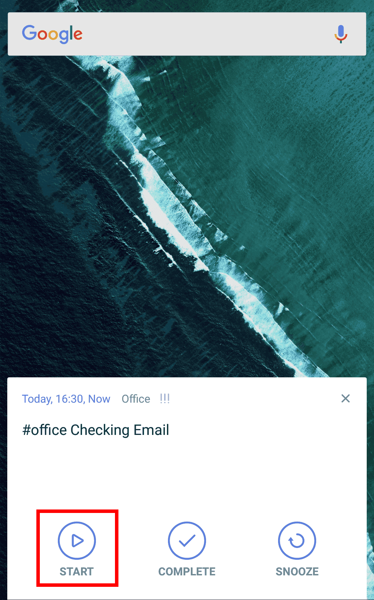
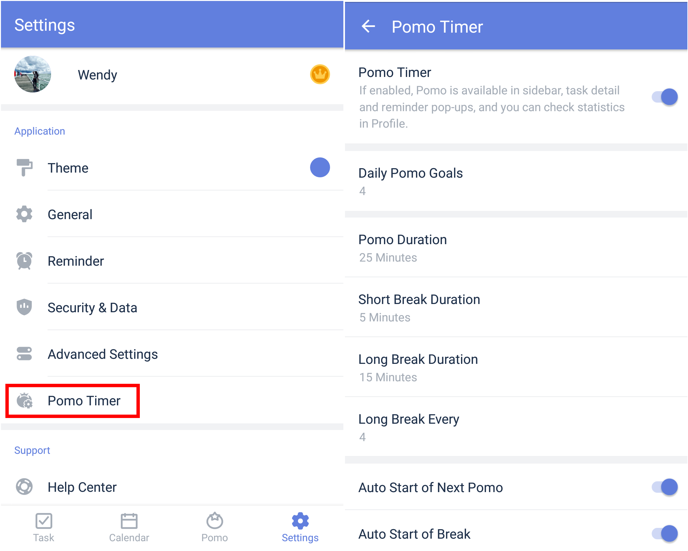

####Enable pomo timer in TickTick
Pomo timer function is hidden by default. To enable it, please go to the Settings tab page and find Pomo Timer to enable. 
####Three ways to start a Pomo Timer
#####From the Pomo tab page:
1. Go to the Pomo tab page.
2. Tap "Start" once you are ready to begin focusing.

##### From a task view: 
Click the three dots icon at the top right->Tap "Start A Pomo".

#####From a task notification:
When a notificaiton pops up in TickTick, you can tap the "START" icon and begin to focus rightaway.

 
####How to custom my Pomo settings?
1. Go to the Settings tab page, then select "Pomo Timer".
2. Customize the settings such as Short break Duration, Long Break Duration,etc.

**Tips** :"Lights on" is a function that will allow the screen to remain bright during a Pomo once you turn it on.

####Can I skip to break or pause a Pomo?
No. Except for abandoning the current pomo, the function is not designed to be interrupted by other actions. The Pomo Timer was developed based on The Pomodoro Tehcnique - one of the most useful time management methods in the world. For more info: https://cirillocompany.de/pages/pomodoro-technique

