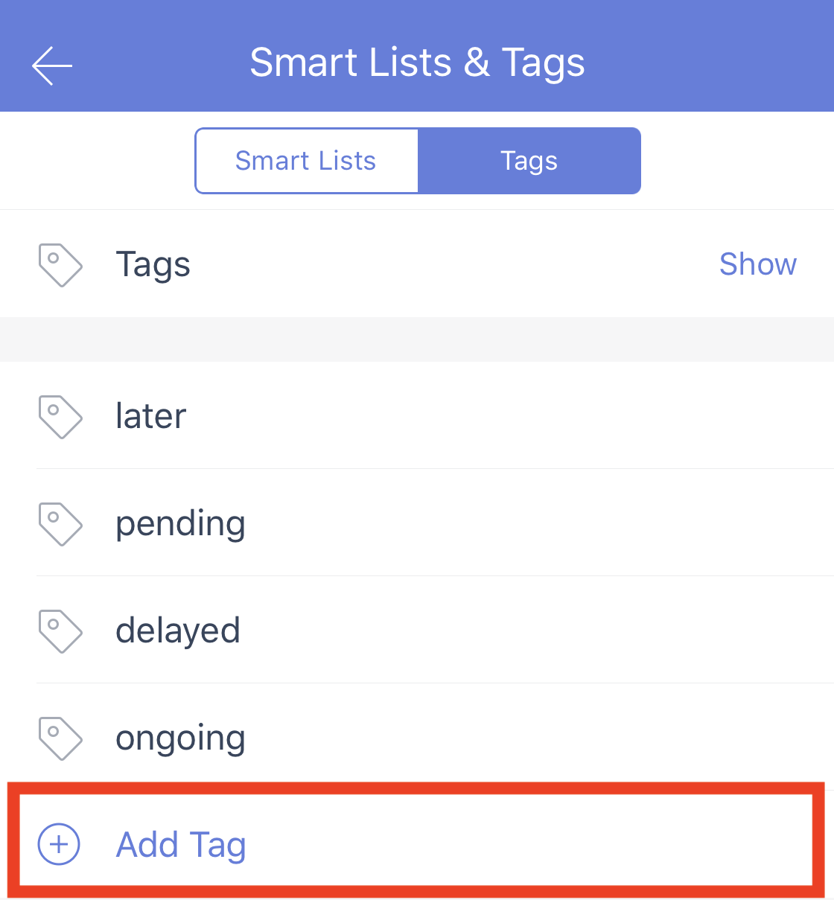

### How to create tags when there's no tasks?

If you already have a complete tagging system sorted in mind, you can start to create tags without new tasks. 

How: 
Go to Settings - Smart Lists & Tags - Tags - Add tags

For example, you can name your tags as different task status.

-Ongoing
-Delayed
-Pending
-Later
