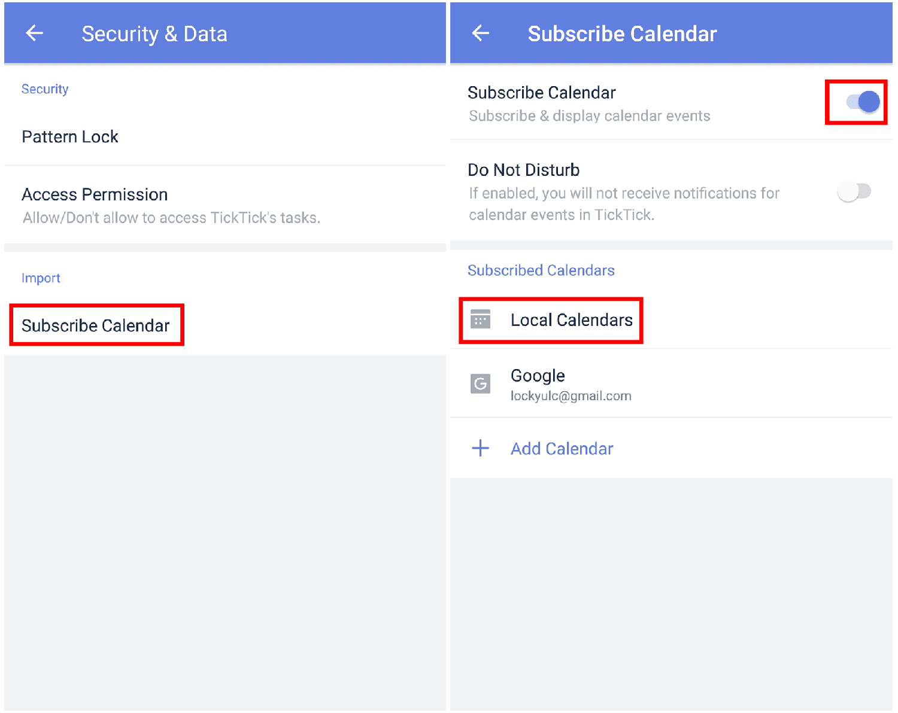

### How to show local calendar events in TickTick?

1. Open TickTick on your Android device, then go to the Settings tab page.

2. Tap "Security & Data", then tap "Subscribe Calendar".

3. Enable "Subscribe Calendar", then select local calendars to be displayed in TickTick.

