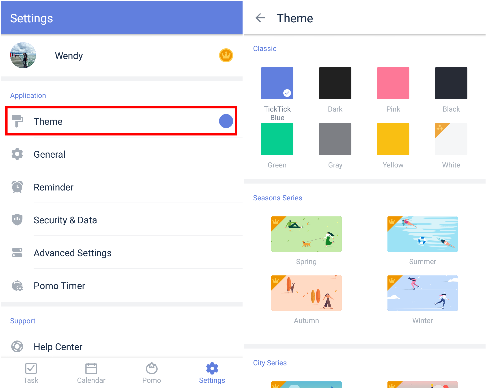

### How to change themes?

TickTick for Android gives you a choice of themes between various colors and other scenes.

1. Open TickTick on your Android device, then go to the Settings tab page.
2. Tap "Theme" and select a theme.

