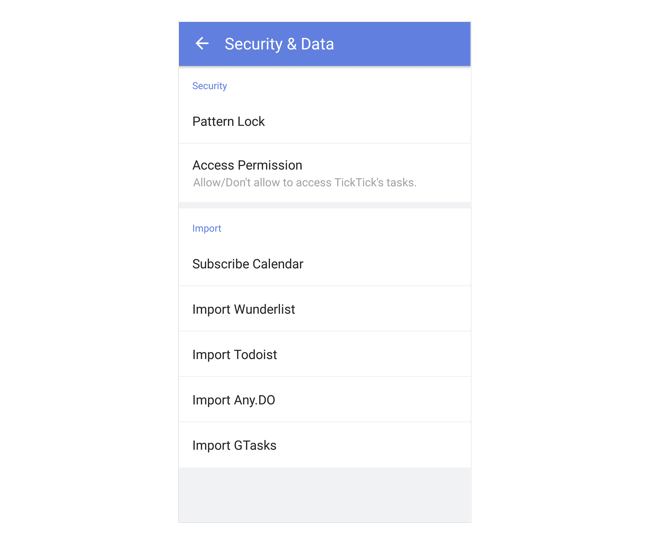

### How to import my data from other applications?

Go to Settings tab page - Security & Data. You can choose to import from Wunderlist, Todoist, Any.do or GTasks. For more third-party apps importing, please go to TickTick Web app.

