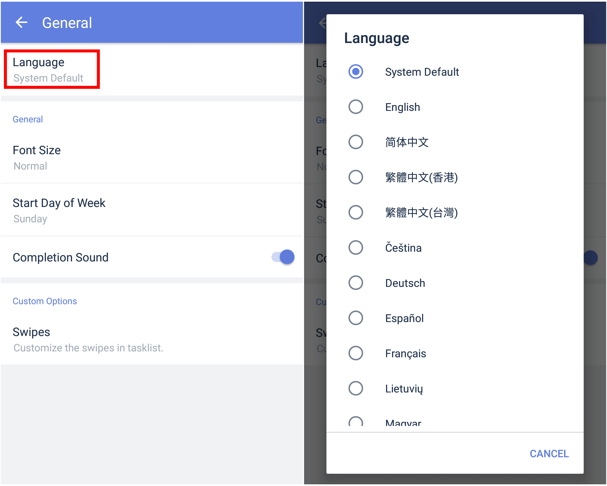

### How to set language in TickTick?

1.Open TickTick on your Android device, then go to the Settings tab page.

2.Tap "General", then tap "Language".

There are more than 20 languages in TickTick for Android. Most of the languages were translated by our users. TickTick would not be the multi-language app that it is without users' continued help and contributions. If you are interested in helping us with translation, please do not hesitate to let us know.)

