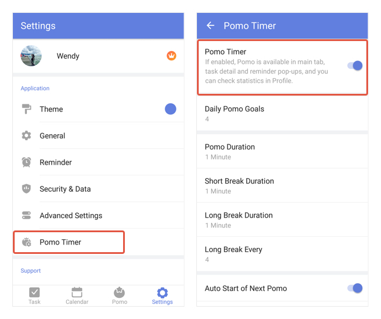

### How to add Pomo Timer to the tab bar?

When you first install and open TickTick on your mobile, the Pomo Timer feature may not be turned on and displayed on the tab bar. Here's how you can enable it on manually:

1. Open TickTick and go to the Settings tab page.
2. Find Pomo Timer -> Tap into it.
3. Switch the first option "Pomo Timer" on.

You may also hide this function from the tab bar by following the instruction above.

