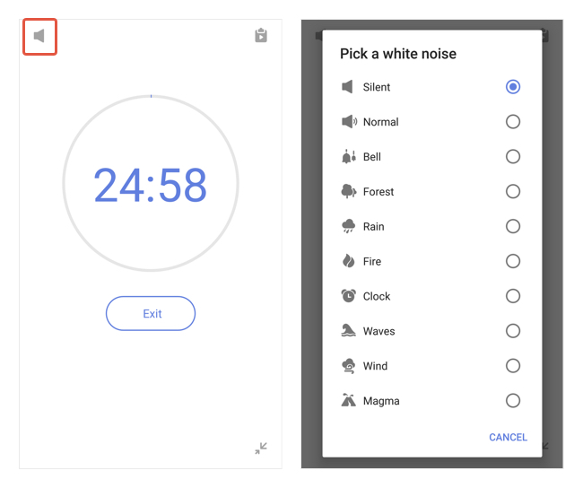

#### How to play a white noise during a pomo?

Once the pomo timer's started, a "White Noise" icon will appear at the top left. You can tap into it and select a white noise to play at the background.

 P.S. White noise can only be played one in a time. You cannot select to play multiple white noises together.

