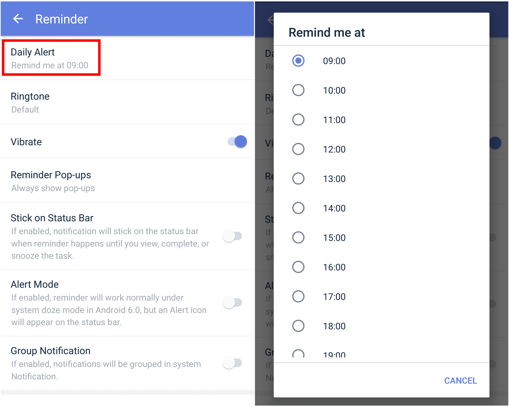

### How to set "Daily Alert"?

Daily Alert provides you with a daily summary of all the tasks you have scheduled for today. You choose when this alert occurs.

1. Open TickTick on your Android device, then go to the Settings tab page.

2. Tap "Reminder", then tap "Daily Alert" to choose a time for the alert to occur.

