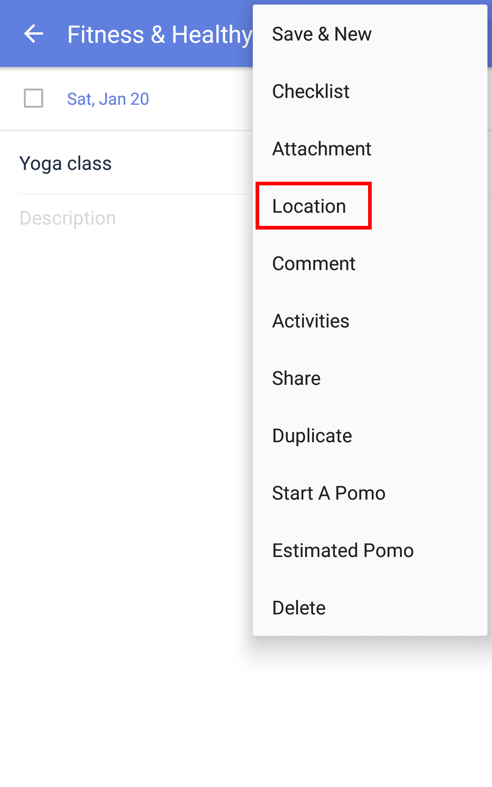

### How to set up location-based reminder?

1. Open TickTick on your Android device, then enter a task detail page from the Task tab page.

2. Tap the option menu in the upper-right corner, then tap "Location".

3. Enter an address and choose to be reminded either upon arrival or leaving.

Your phone's location services (GPS) must be active for location-based reminders to function.

