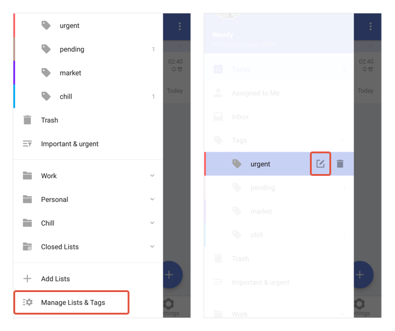

### How to edit / delete existing tags

Once you have a commonly used tag that’s associated with many tasks, edit the tag name or delete the tag and auto remove it from all tasks would be very useful.

Two ways to do it: 1. Manage Lists & Tags - Tags - Select the tag you want to edit / delete 2. Long press on a tag name at the left sidebar - Tag the "Edit" icon

Note: You can set a tag color in "Edit" as well.

