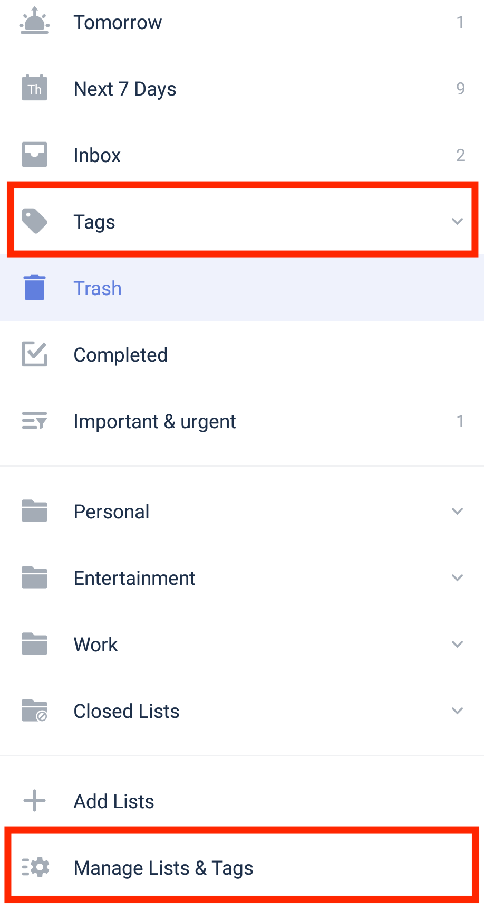
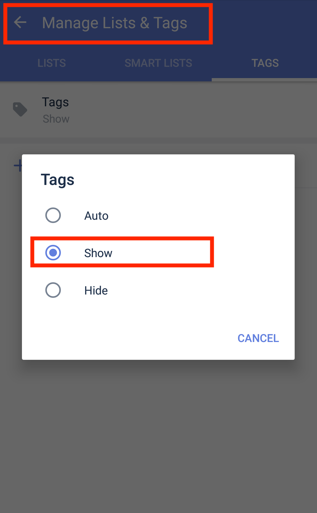

### Show Tags on the left sidebar

The settings page for tags locates at Manage Lists & Tags. You can find it at the bottom of the left sidebar.

Tags can be shown on the left sidebar,along with other smart lists. If you can’t find Tags there, go to its Settings page, check if you’ve enabled to "Show" Tags.

