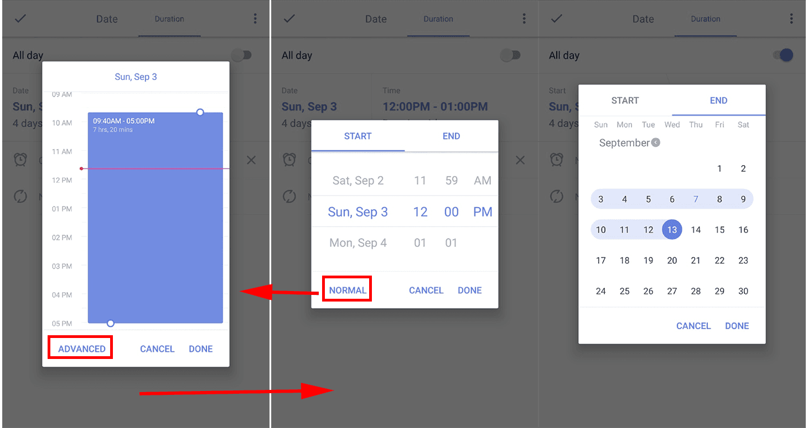

### How to add a duration to task?

With "Time Duration" function, you can set both start time and end time to a task. It supports for tasks that cost two or more days as well.

Sign in to TickTick -> Click a task to is details view -> Tap Date to switch to Duration ->Tap Time to select normal/advanced options

**P.S.**

Normal mode: set time duration within one day

Advanced mode: custom both start time and end time (no limitation)

