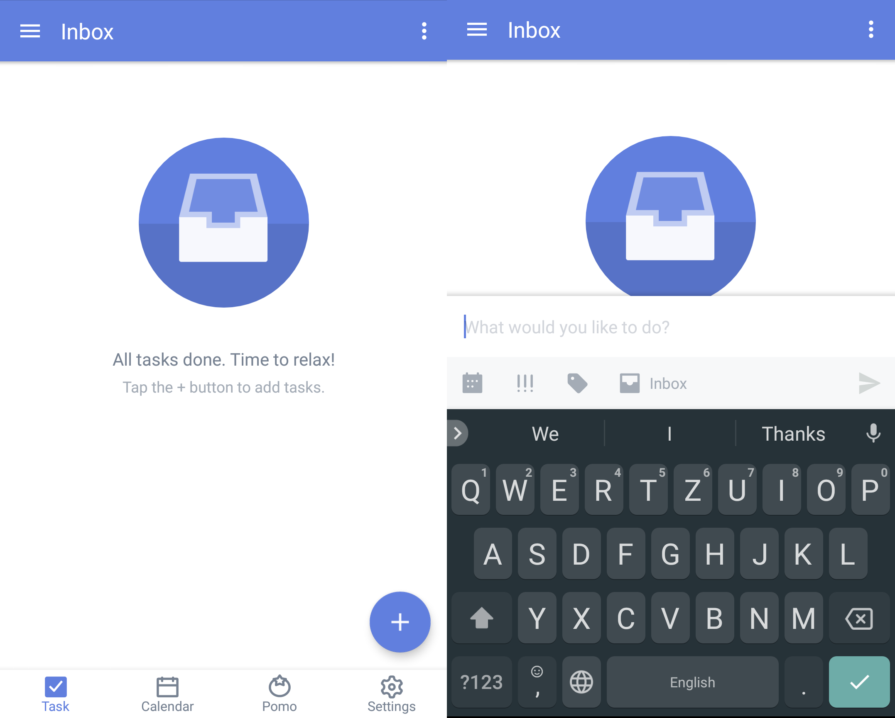
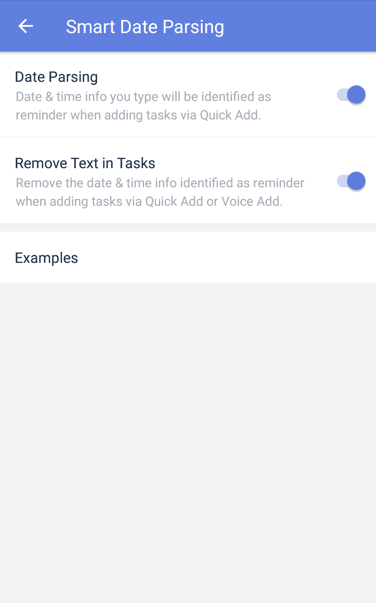
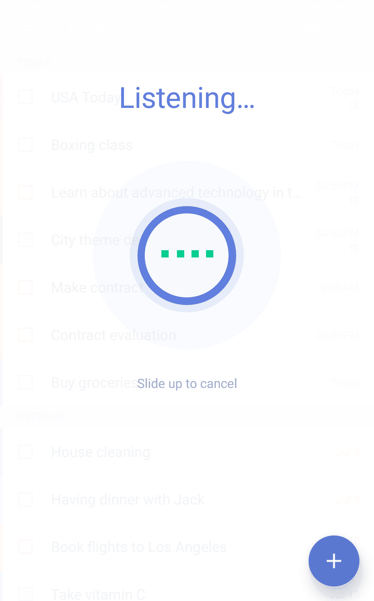

### How to create a new task?

With TickTick, you have six different ways to add a new task, giving you the power to choose a method that works best for you.

**Option 1: Add a task from the Quick Add bar**

1. Open TickTick on your Android device and go to the Task tab.

2. Tap on the "+" symbol at the bottom of the list to add a new task.

##### **Smart Date Parsing when adding tasks from Quick Add bar**

If you type or say the date and time information for your task when using the Quick Add bar, TickTick will automatically set the date you gave as due date and set the time you gave as the time for that task to occur.

For example, if you want to go to library on next Saturday at 2 pm, you just need to type: "Go to library next Saturday 2 pm", then TickTick will automatically recognize the date of next Saturday as the task's due date and set 2 pm as its reminder.

You can also select a list to add your new task to when using the Quick Add Bar. Tap the icon marked "Inbox" above the Quick Add Bar and select a list from the choices given or create a new list.

**Note**: Can't see quick add bar, only a "+" icon?

Go to "Advanced Settings" -> "Quick Add" -> Double check whether you've enabled it

##### Remove date & time info from task content when using Smart Date Parsing

If you prefer date and time not showing in your task content after your task is created, tap Settings > Advanced Settings > Smart Date Parsing, then select "Remove Text in Tasks"

After "Remove Text in Tasks" is enabled, the highlighted date & time text will be removed from the text of your task.

  **Option 2: Add a task from "Status Bar".**

The Status Bar is a persistent notification bar that appears in your phone's main dropdown menu. You can add a new task directly to TickTick this way. To enable "Status Bar", You should:

1. Open TickTick on your Android device, then either swipe to the right or tap the hamburger button in the upper-left corner.

2. Tap the gear-shaped icon in the upper-right corner.

3. Tap "Advanced Settings", the select "Status Bar" to enable it.

The Status Bar is in the pull-down menu of your phone. Click "+" on the Status Bar to add a task without having to open the Ticktick app.

**Option 3: Add a task from widget (turn to 3.6.4 for details).**

Tasks in the "Completed" list are sorted by completion date. If you want to view completed tasks in a specific list, you can tap the funnel-shaped icon in the upper-right corner to select a list. Dates at left are completion dates while dates at right are due dates.

**Option 4: Add a task by voice input.**

Long press the "+" button in the bottom-right corner, then hold to speak. If you state a date and time, TickTick will schedule your new task for that same date and time.

**Option 5: Add a task by "note to self" voice command with Google Now.**

1. Make sure the Google Now app is loaded on your smartphone or tablet.

2. Hit the microphone icon on the search widget to initiate a voice-based search.

3. Start by saying "note to self". For example, you can say "note to self, have lunch with Jack tomorrow at 1 pm."

4. Select TickTick to save the task.

