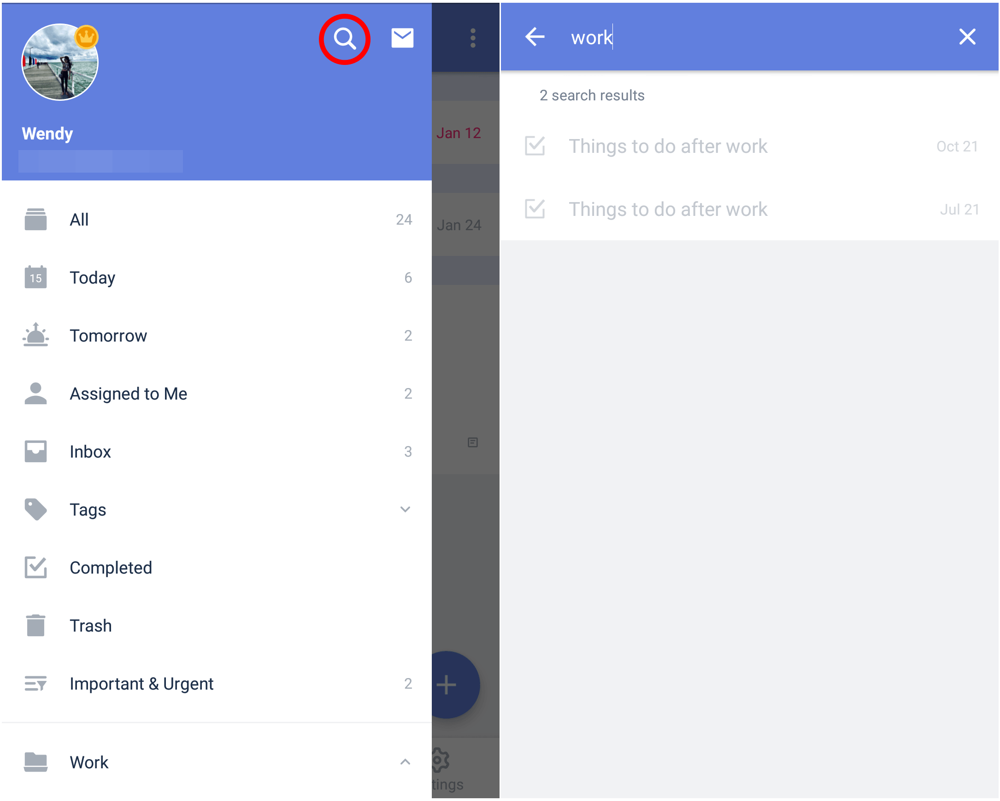

### How to search for a task?

1. Open TickTick on your Android device, then either swipe to the right or tap the hamburger button in the upper-left corner.

2. Tap on the magnifying glass icon, then type in your search term and any matching tasks will appear below.

