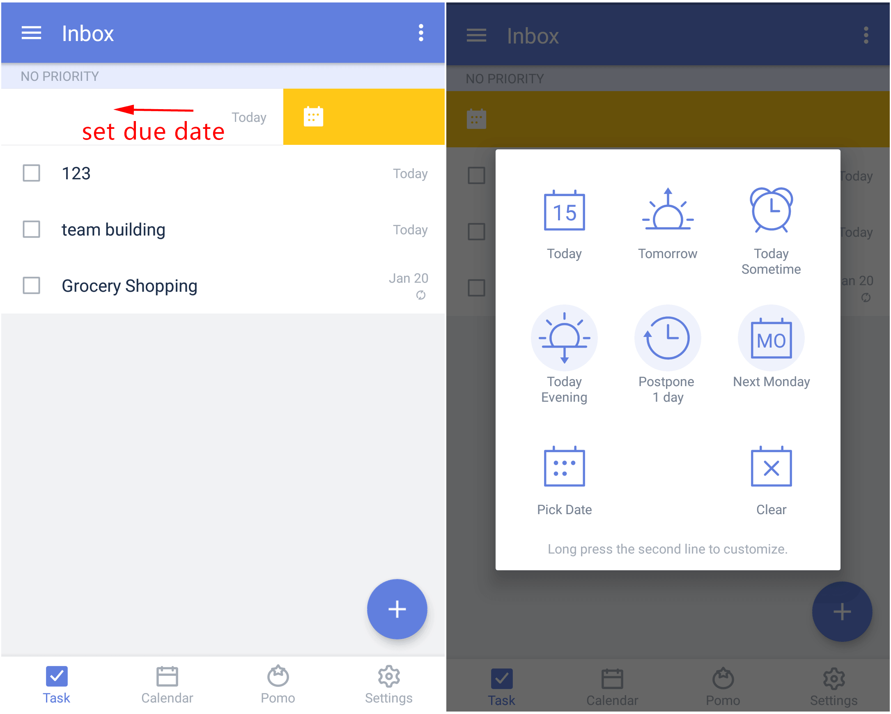
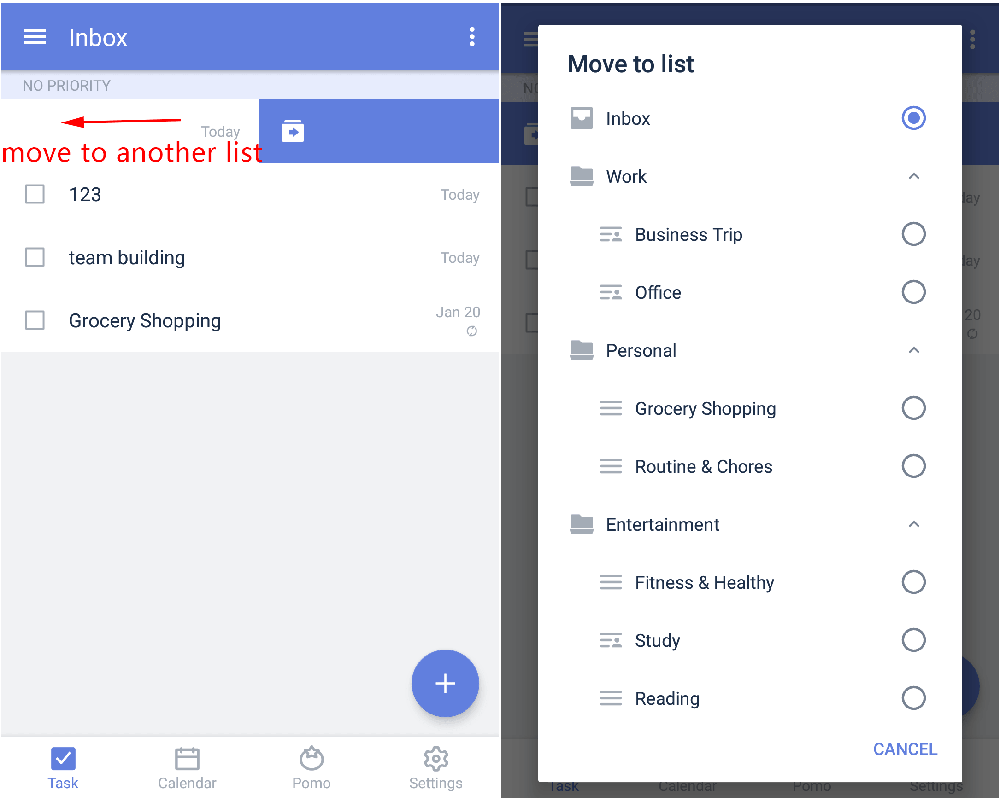
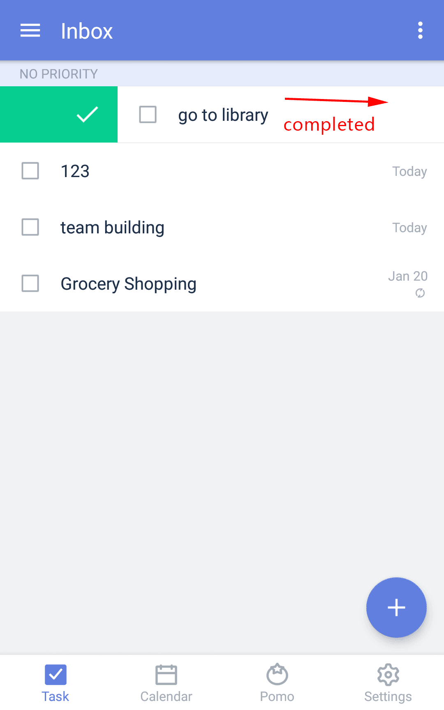

### How to swipe tasks for quick actions?

Sliding a task left or right causes four actions to occur. Each action has its own color. Here are the actions, colors, and ways to swipe:

* To set a due date, Slowly swipe the task to the left, and release when yellow appears.

* To move a task to another list, slowly swipe the task to the left until blue appears.

* To mark a task as completed, slowly swipe the task to the right until green appears.

* To set priority for a task, swipe the task to the right, and release when orange appears.

* 

