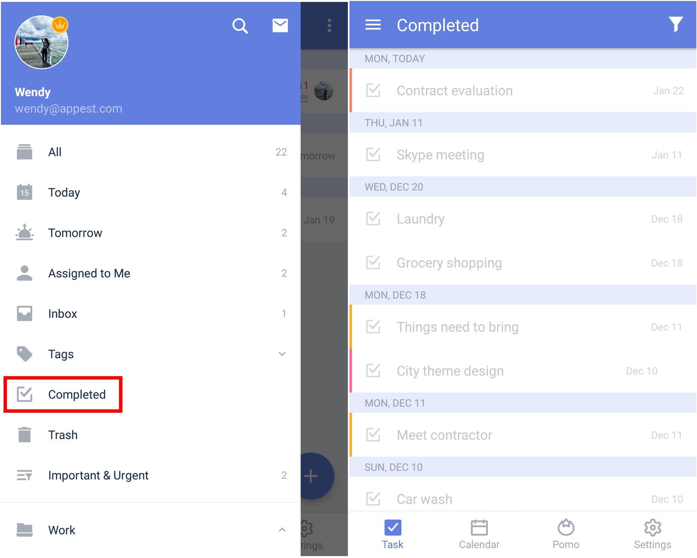

### Where can I view my completed tasks?

You can check all your completed tasks in the "Completed" list, which is hidden by default. Please see section 3.2.1 to learn how to show the "Completed" list in TickTick.

Tap the "Completed" list in the sidebar menu. Tasks in the "Completed" list are sorted by completion date. If you are viewing the "Completed" list and you want to view completed tasks in a specific list, simply tap the funnel-shaped icon in the upper-right corner to select a list. Dates appearing on the left are completion dates, and dates on the right are the due dates.

