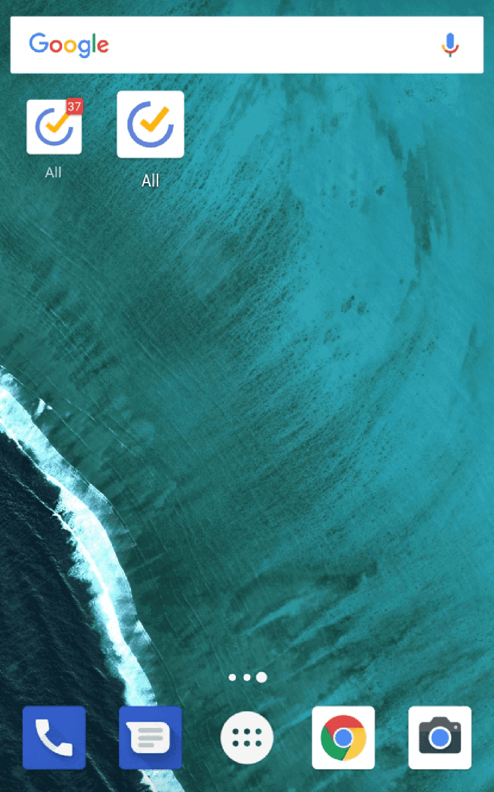

### What's the difference between TickTick Undone & TickTick Shortcut?

TickTick Undone 1x1 provides you with a count of the number of your overdue tasks plus today's tasks. If your overdue & today's tasks are more than 9, TickTick Undone will display 9+ instead of the actual number. TickTick Shortcut 1*1 is simply an icon you can place on your home screen for easy, one-tap access to your TickTick app.

**P.S.** Some android devices don't have TickTick Shortcut 1*1

